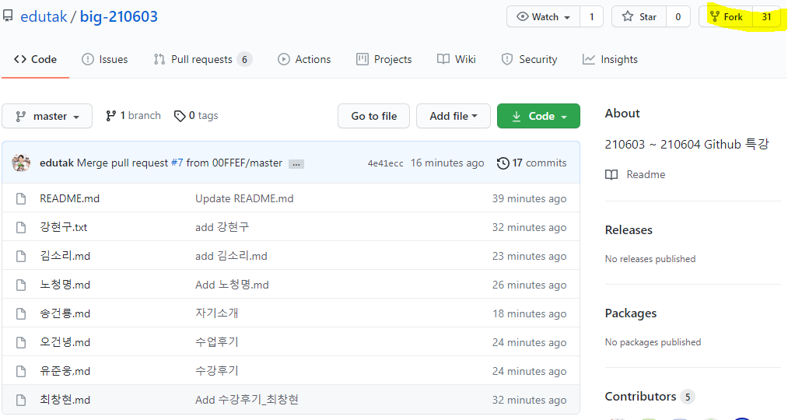
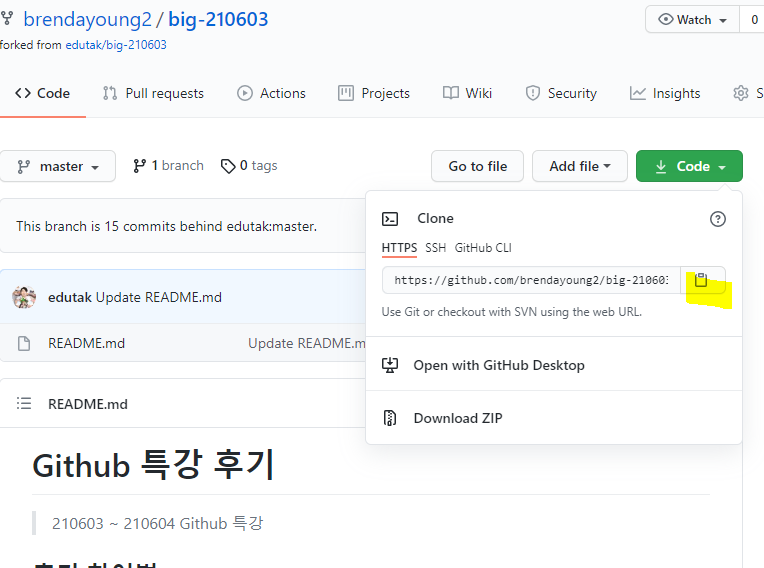
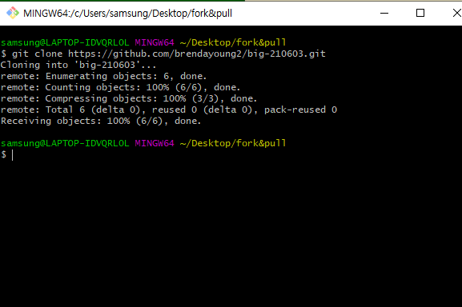
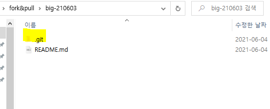
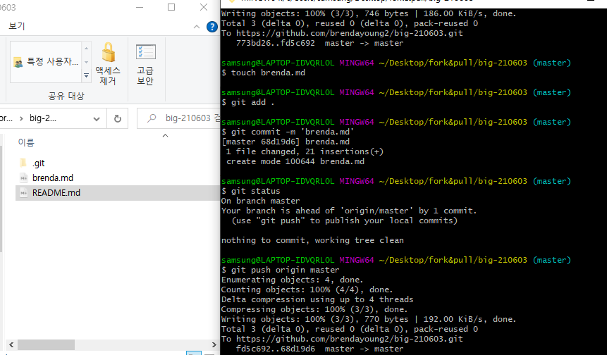
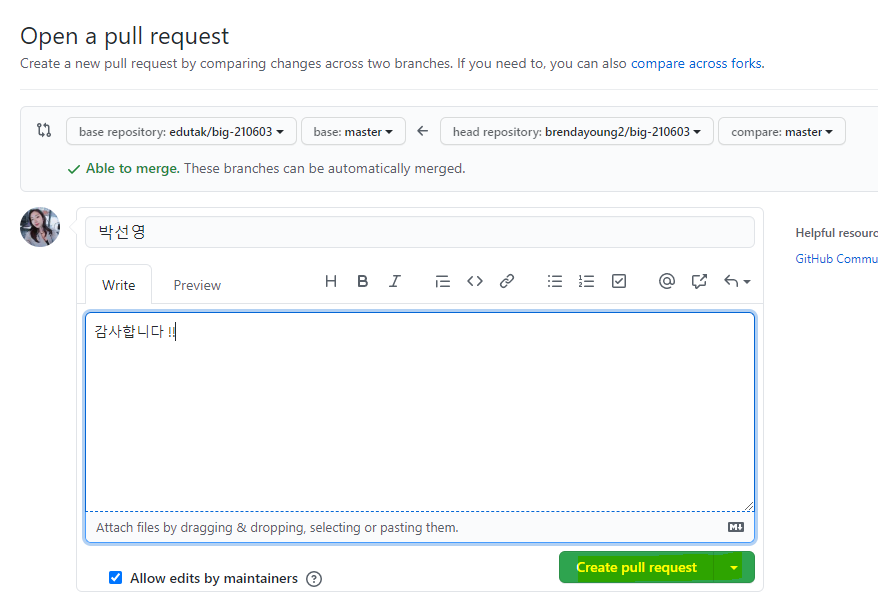

# Fork and pull model

1. 해당 저장소를 `fork` 한다.



2. 본인에게 fork된 저장소를 clone 한다.



- **반드시!!!! 본인 저장소인거 확인**

3. 데스크톱에 파일 생성후 gitbash를 열어 Clone을 한다.

```bash
$ git clone https://github.com/brendayoung2/big-210603.git
```



4. Gitbash 를 껏다가 키면 해당 repository가 생성되있는것을 확인한다.



* .git 있는지 확인후 그 자리에서 git bash 열기

5. Gitbash를 열어 본인의 이름으로 마크다운 파일을 생성하고, 후기를 작성한다. > 나의경우

```
$ touch brenda.md
```



```
당연히 add, commit 해야겠죠 ^__^
```

```
$ git push origin master
```

(내 깃허브에 변경사항을 포함한 내용을 올리기 위해서) 
나의 저장소 => A의 깃허브 저장소로 보낸다

6. Github에 들어와서 PR을 보낸다!



full request 와 변경내용을 적은 description을 작성하여 보낸다.
=> Contributor가 되는것

!!!!!!!! 끝 !!!!!!!

